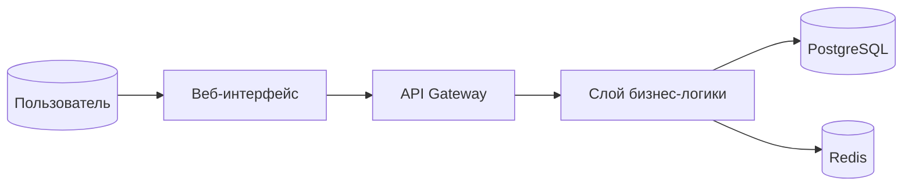
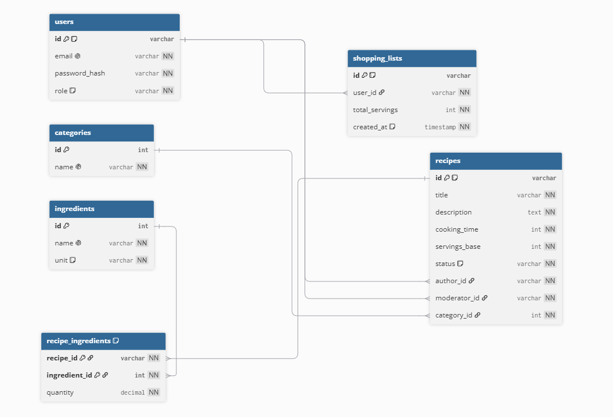

# Архитектура платформы шеринга рецептов и планирования меню

## 1. Назначение системы

Платформа предназначена для публикации кулинарных рецептов с возможностью их модерации и автоматического пересчёта ингредиентов под заданное количество порций. Система позволяет пользователям создавать списки покупок на основе выбранных блюд.

Основные роли:
* **Кулинар** — публикует рецепты, создаёт списки покупок.
* **Шеф-редактор** — проверяет новые рецепты перед публикацией.

## 2. Роли и Use Cases

### Кулинар
* Регистрация / Вход в систему
* Просмотр популярных рецептов
* Поиск рецепта по ингредиентам или названию
* Создание нового рецепта *(автор обязательно)*
* Редактирование собственного рецепта
* Удаление собственного рецепта
* Добавление/изменение списка ингредиентов к рецепту *(обязательно)*
* Генерация списка покупок на основе выбранного блюда *(автоматически системой)*

### Шеф-редактор
* Проверка новых рецептов *(публикация / отклонение; обязательный модератор)*
* Управление категориями блюд *(добавление новой категории)*.
* Просмотр аналитических отчётов о популярности категорий.

### Система
*(Автоматические действия)*
* Пересчёт количества ингредиентов при изменении числа порций.
* Формирование списка покупок из рецептурных ингредиентов.

---

## 3. Диаграмма C4 Container

## 4. Модель данных (ERD, 3NF)

База данных спроектирована в третьей нормальной форме (3NF).

### Таблицы

#### users — пользователи
* `id` *(PK, UUID)* — уникальный идентификатор пользователя.
* `email` *(varchar, UNIQUE, NOT NULL)* — адрес электронной почты.
* `password_hash` *(varchar, NOT NULL)* — хеш пароля.
* `role` *(enum, NOT NULL)* — роль (`culinarian` / `chef_editor`).

#### categories — категории блюд
* `id` *(PK, int)* — идентификатор категории.
* `name` *(varchar, UNIQUE, NOT NULL)* — название категории (закуски, супы, десерты).

#### ingredients — справочник ингредиентов
* `id` *(PK, int)* — идентификатор ингредиента.
* `name` *(varchar, UNIQUE, NOT NULL)* — название (мука пшеничная, сахар, соль).
* `unit` *(varchar, NOT NULL)* — единица измерения (г, мл, шт.).

#### recipes — рецепты
* `id` *(PK, UUID)* — идентификатор рецепта.
* `title` *(varchar, NOT NULL)* — заголовок.
* `description` *(text, NOT NULL)* — описание приготовления.
* `cooking_time` *(int, NOT NULL)* — время готовки в минутах.
* `servings_base` *(int, NOT NULL)* — базовое число порций (для расчёта ингредиентов).
* `status` *(enum, DEFAULT 'pending', NOT NULL)* — статус (`pending` — на модерации, `published` — опубликован, `rejected` — отклонён).
* `author_id` *(FK → users.id, NOT NULL)* — автор рецепта *(обязательный)*.
* `moderator_id` *(FK → users.id, NOT NULL)* — кто модерировал *(обязательный)*.
* `category_id` *(FK → categories.id, NOT NULL)* — категория *(обязательная)*.

#### recipe_ingredients — состав рецепта (связь N:M)
Эта таблица реализует связь «многие ко многим» между рецептами и ингредиентами.

* `recipe_id` *(FK → recipes.id, NOT NULL)* — ссылка на рецепт.
* `ingredient_id` *(FK → ingredients.id, NOT NULL)* — ссылка на ингредиент.
* `quantity` *(decimal(10,2), NOT NULL)* — количество на базовое число порций.

*(Комбинированный первичный ключ: `(recipe_id, ingredient_id)`)*.

#### shopping_lists — списки покупок
* `id` *(PK, UUID)* — идентификатор списка.
* `user_id` *(FK → users.id, NOT NULL)* — владелец списка.
* `total_servings` *(int, NOT NULL)* — общее число порций (на сколько человек рассчитывается список).
* `created_at` *(timestamp with time zone, DEFAULT NOW(), NOT NULL)* — дата создания.

*(В этой таблице нет прямой ссылки на рецепт. Список формируется динамически на основе рецептурных ингредиентов.)*

---

### Связи

* `users` ⟷N `recipes`: один пользователь может иметь много рецептов *(через author_id)*.
* `categories` ⟷N `recipes`: одна категория объединяет множество рецептов *(через category_id)*.
* `recipes` N⟹M `ingredients`: один рецепт содержит несколько ингредиентов, один ингредиент входит во многие рецепты *(через связующую таблицу recipe_ingredients)*.
* `users` ⟷N `shopping_lists`: один пользователь может создать много списков покупок *(через user_id)*.

---

## Приложение. Визуальная ERD

Картинка ER-диаграммы доступна здесь: 

